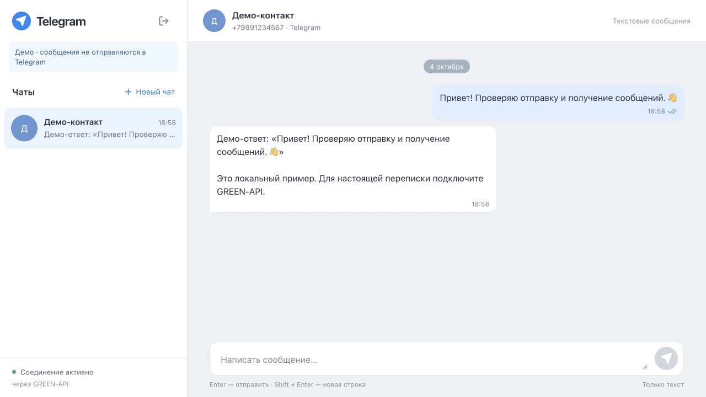

# Telegram Chat · GREEN-API

Минимальный интерфейс для отправки и получения текстовых сообщений в Telegram через GREEN-API.

В задании разрешён Telegram как альтернатива MAX. Реализован именно этот вариант; интерфейс использует привычную компоновку Telegram Web: список чатов слева, переписка и поле сообщения справа.



## Локальный запуск

Нужны **Node.js 24 LTS (не ниже 24.15) или 26+** и npm. После скачивания или клонирования репозитория перейдите в каталог проекта:

```bash
npm ci
npm run dev
```

Откройте адрес, который выведет Vite, обычно `http://127.0.0.1:5173`.

Переменные окружения и сервер не нужны. `idInstance`, `apiTokenInstance` и при необходимости API URL вводятся в форме приложения. Настоящие значения в исходниках отсутствуют.

## Подключение Telegram

1. Создайте и авторизуйте **Telegram-инстанс** в [личном кабинете GREEN-API](https://console.green-api.com/).
2. В настройках включите `incomingWebhook: "yes"`, оставьте `webhookUrl` пустым. Для статусов доставки включите `outgoingWebhook: "yes"`.
3. Дождитесь применения настроек и состояния `authorized`.
4. Введите `idInstance` и `apiTokenInstance`. Если в кабинете указан отдельный API URL, раскройте «Настроить API URL» и скопируйте его. По умолчанию используется `https://api.green-api.com`.
5. Создайте чат по международному номеру получателя, например `+7 (999) 123-45-67`.
6. Отправьте текст, ответьте с аккаунта получателя в Telegram и проверьте появление ответа в браузере.

Подробная инструкция, ограничения приватности Telegram и проверка реального диалога: **[docs/SETUP.md](docs/SETUP.md)**.

Кнопка «Посмотреть демо без подключения» запускает отдельный локальный клиент. Демо явно помечено; его ответы не поступают из Telegram и не отправляются в мессенджер. Это удобный способ посмотреть интерфейс без доступа к инстансу.

## Возможности

- Вход с проверкой авторизации и настроек получения.
- Создание личного чата по номеру через `checkAccount`, работа с каноническим `chatId`.
- Отправка текста через `sendMessage`, лимит **4096** символов.
- Получение через `receiveNotification` и подтверждение через `deleteNotification`.
- Несколько чатов, отметки непрочитанных, статусы отправки и доставки.
- Enter для отправки, Shift + Enter для переноса строки, поддержка IME.
- Мобильный вид с переходом между списком чатов и перепиской.
- Восстановление получения при временных ошибках сети.

## Проверки

```bash
npm run lint
npm test
npm run build
# Или все проверки одной командой:
npm run check
```

Vitest и Testing Library проверяют контракты HTTP, валидацию, безопасные ошибки, отсутствие автоматических повторов отправки, очередь уведомлений, дедупликацию, статусы и весь сценарий вход → создание чата → отправка → ответ → выход в React StrictMode.

Автоматические сценарии используют подменённые ответы API. Они проверяют код и интеграцию интерфейса, но не заменяют обмен сообщениями с настоящим Telegram-инстансом. Без подключённого инстанса такой обмен не заявляется как проверенный.

## Сборка и размещение

```bash
npm run build
npm run preview
```

Каталог `dist/` содержит статическую сборку. Его можно размещать на GitHub Pages, Cloudflare Pages или другом статическом хостинге. Относительные пути к ресурсам позволяют запускать приложение и в подкаталоге. HTTPS обязателен для публичного размещения; API URL всегда проверяется как HTTPS-адрес GREEN-API.

Для GitHub Pages подготовлен workflow: он проверяет код, выполняет тесты, собирает приложение и публикует `dist`. В настройках репозитория выберите **Settings → Pages → Source → GitHub Actions**. Изменения в `main` запускают проверки и публикацию; pull request выполняет только проверки.

## Устройство проекта

```text
src/
  api/                 HTTP-клиент, очередь уведомлений, демо-клиент
  chat/                Модель чатов, reducer, управление сессией
  components/          Вход и рабочая область чата
  App.tsx              Переключение между входом и сессией
  styles.css           Адаптивный интерфейс
docs/
  SETUP.md             Подготовка инстанса и ручная проверка
  screenshots/         Вход, переписка на компьютере и телефоне
```

React + TypeScript + Vite, обычный CSS, Lucide для иконок. Небольшой объём состояния не требует Redux; управление чатами вынесено в reducer, транспорт отделён от UI.

## Детали, важные для корректности

- Telegram возвращает отдельный строковый `chatId`. Номер нужен для `checkAccount`, а не для формирования WhatsApp-идентификатора.
- `idMessage` от `sendMessage` означает приём в очередь GREEN-API. Доставка отображается только после соответствующего уведомления.
- Один последовательный цикл выполняет получение, обработку и ACK. Перезапуск эффекта в StrictMode ждёт завершения предыдущего цикла.
- При сбое ACK повторяется подтверждение; повторное входящее сообщение не дублируется в истории. `result: false` не блокирует очередь: уведомление могло быть удалено предыдущим запросом.
- Сервисные уведомления и неподдерживаемые типы подтверждаются и пропускаются, чтобы не блокировать очередь. Текст, в том числе URL и цитируемый текст, отображается без исполнения HTML.
- Статус сообщения может прийти раньше ответа на отправку — reducer сохраняет его по `idMessage`.
- POST отправки не повторяется автоматически. При тайм-ауте результат помечается как неподтверждённый: сообщение могло быть принято сервером.
- Выход отменяет незавершённые запросы и очищает состояние сессии. Чаты и ключ не сохраняются между перезагрузками.

## Ограничения

Это клиент для тестового задания, без истории с сервера, вложений, групп и долговременного хранения. Телефон может быть скрыт настройками приватности Telegram; `exist: false` не всегда означает отсутствие аккаунта.

Ключ хранится только в памяти страницы, не попадает в localStorage, sessionStorage, cookies, исходники и сообщения ошибок. В браузерном приложении владелец устройства всё равно может увидеть ключ в сетевых запросах — это особенность требуемого прямого доступа к GREEN-API. Для многопользовательского production-продукта нужен серверный посредник с отдельной авторизацией.

Очередь принадлежит инстансу. Используйте для проверки выделенный тестовый инстанс и одну вкладку клиента; другие приложения или webhook на том же инстансе могут забирать те же уведомления. Приложение не изменяет настройки инстанса автоматически.

## Документация API

- [Формат запросов Telegram](https://green-api.com/telegram/docs/request-format/)
- [CheckAccount](https://green-api.com/telegram/docs/api/service/CheckAccount/)
- [SendMessage](https://green-api.com/telegram/docs/api/sending/SendMessage/)
- [Получение через HTTP API](https://green-api.com/telegram/docs/api/receiving/technology-http-api/)
- [ReceiveNotification](https://green-api.com/telegram/docs/api/receiving/technology-http-api/ReceiveNotification/)
- [DeleteNotification](https://green-api.com/telegram/docs/api/receiving/technology-http-api/DeleteNotification/)
- [Статусы исходящих сообщений](https://green-api.com/telegram/docs/api/receiving/notifications-format/statuses/OutgoingMessageStatus/)
